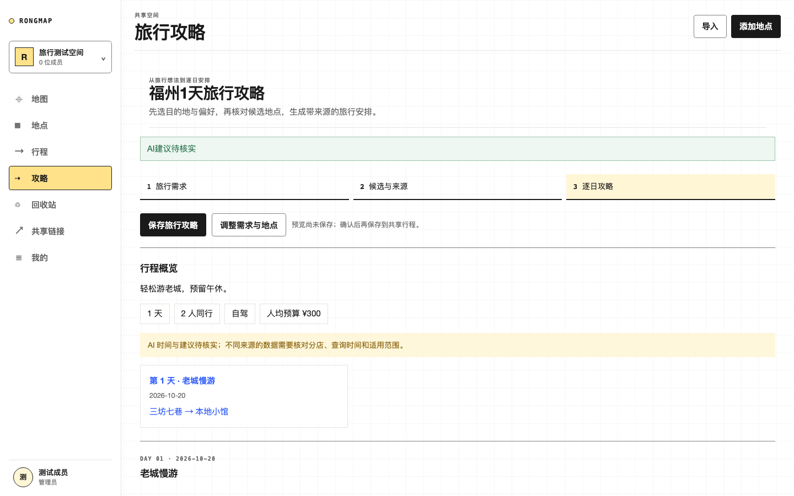
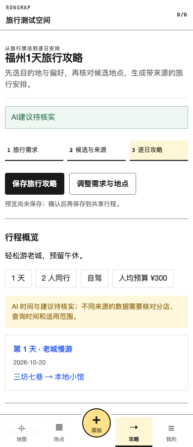

# RongMap

亲友共享的地点地图与旅行攻略工作台。成员共同收藏、整理地点，填写目的地和旅行需求，从候选地点生成逐日攻略，核验路线与天气，保存、导出或分享给亲友。

React 19 + Vite 7 前端，Supabase 承载认证、Postgres 与 Realtime，Vercel 托管前端与 Serverless API，高德负责地图与路线，DeepSeek 提供 AI 旅行规划。

## 界面

桌面端旅行攻略预览（本地浏览器运行，示例测试数据）：



移动端同一份攻略（示例测试数据）：



## 功能

**地点**　三栏地图工作台（`/app/map`）与全量管理页（`/app/locations`）：组合筛选、排序、批量打标签、软删除与恢复、CSV/JSON 导入导出、批量导入向导。高德地点搜索与坐标回填。

**行程**　`/app/trips` 从已选地点生成逐日行程，`/app/trips/:id` 分天编排、跨天移动、路线优化、撤销重做。路线优化用直线距离 + 全起点近邻搜索 + 2-opt 局部优化，未定位地点保持原相对顺序并置于当天末尾。

**旅行攻略**　`/app/travel` 替代原路书 tab：填写目的地城市、日期、天数、预算、同行人、已订住宿与硬约束 → 搜集和核对景点／餐饮候选 → 生成攻略预览 → 保存到共享行程。阅读页包括总览、逐日时间轴、美食候选、住宿逻辑、雨天备选、避坑与预约清单、来源状态。旧 `/app/roadbook/:id` 链接转到 `/app/travel/:id`，既有行程和路书数据仍可读取。

**来源与核验**　高德提供地址、坐标、平台返回的商户信息，以及保存后的驾车／步行／公交路线与预报窗口内天气。可选小红书／点评 MCP 以只读工具采集；小红书搜索与最多两篇详情串行执行，每次详情独立请求，点评同样最多两家商户详情。未配置、失败、仅搜索和已读详情的范围分别标注。手动补充来源时需粘贴摘录，链接不会自动抓取全文。不同来源的同名商户不自动视为同一分店或已完成交叉验证。

**AI 规划**　服务端调用 DeepSeek 官方接口（默认 `deepseek-flash`），最多选择 24 个已查询候选、规划 1–14 天。候选凭证有 30 分钟有效期，并绑定用户和空间；服务端验证模型地点 ID，坐标与名称从查询快照回填。AI 票价强制留空，用户的人数／交通／预算不会被模型改写。需求、所选地点及补充来源摘录会发送给 AI，成员身份和凭据不会发送。鉴权失败返回可读配置错误，生成失败保留需求并允许重试。保存使用已有事务 RPC；导出为自包含 HTML 快照，包含当页已查询的路线与天气，分享页展示已保存攻略。

**协作**　用户名登录（无邮箱验证、无密码）；管理员在 `/app/settings` 注册成员，对方即刻可用该用户名登录。30 天回收站（`bootstrap` 读取时惰性清理到期条目）。共享链接支持完整空间或单个行程两种范围，可随时撤销。

## 快速开始

```bash
npm install
npm run dev
```

只调 UI 时用 Playwright route mock，或设 `RONGMAP_REMOTE_FIRST=0` 避免回源远端部署；需要真实 API 联调时另开终端跑 `vercel dev`（Vite 将 `/api` 代理到 `http://localhost:3000`）。

## 环境变量

复制 `.env.example` 为 `.env.local`。完整清单见该文件，按用途分组：

| 变量 | 用途 |
| --- | --- |
| `VITE_SUPABASE_URL` / `VITE_SUPABASE_ANON_KEY` | 浏览器认证与实时订阅 |
| `SUPABASE_URL` / `SUPABASE_SECRET_KEY` | Serverless 管理客户端；Secret 只放服务端，未设置时回落到 `SUPABASE_SERVICE_ROLE_KEY` |
| `VITE_AMAP_WEB_KEY` / `VITE_AMAP_SECURITY_CODE` | 高德 JS 地图；应在高德控制台限制允许域名 |
| `AMAP_WEB_SERVICE_KEY` | 地点搜索与路线核实（服务端） |
| `DEEPSEEK_API_BASE_URL` / `DEEPSEEK_MODEL` / `DEEPSEEK_API_KEY` | DeepSeek AI 旅行规划；仅服务端，勿用 `VITE_` 前缀 |
| `XHS_MCP_URL` / `CN_SCRAPER_URL` | 可选小红书／点评 MCP 服务端地址；留空显示未接入。云端不能访问 Mac 的 localhost |
| `XHS_MCP_TOKEN` / `CN_SCRAPER_TOKEN` | 可选服务网关 Bearer 认证，仅服务端；平台 Cookie 由 MCP 服务本机保存 |
| `RONGMAP_DEFAULT_MEMBER_PASSWORD` | 成员共享默认密码，至少 8 位，只放服务端 |
| `INITIAL_ADMIN_USERNAME` / `INITIAL_ADMIN_NAME` | 首位管理员的用户名与显示名 |

`RONGMAP_LEGACY_MODE`、KV 相关变量与部署回源变量仅用于迁移窗口期内的兼容调试，生产保持默认。

密钥管理约定：仓库不存放任何真实密钥，缺失时接口直接提示缺哪个变量。密钥一律只进服务端环境变量，并在供应商控制台限制来源域名。

## API

`/api/v2/*` 需携带 Supabase Access Token。免鉴权接口只有两个：`POST /api/v2/session`（用户名换会话）与 `GET /api/v2/public-share`（只读链接读取）。`POST /api/search` 需要登录态且仅接受福州。

| 路径 | 能力 |
| --- | --- |
| `GET /api/v2/bootstrap` | 空间、成员、地点、行程摘要、标签、活动、回收站与链接 |
| `/api/v2/locations` | 创建、版本化更新、软删除 |
| `/api/v2/trips` | 行程摘要、详情、版本化保存、路线优化、删除 |
| `POST /api/v2/travel-guide` | `collect` 搜集候选；`source` 采集单一来源／详情；`generate` 返回逐日攻略预览 |
| `POST /api/v2/roadbook-ai` | 旧版逐日草案兼容接口，前端不再提供原路书向导 |
| `POST /api/v2/roadbook` | 核实已保存行程当天所选交通方式的路段与天气（不缓存） |
| `/api/v2/tags` / `members` | 标签管理、成员用户名注册 |
| `/api/v2/bulk` / `import-preview` / `import-commit` | 批量操作与导入 |
| `/api/v2/trash` | 恢复与管理员永久清理 |
| `/api/v2/share-links` / `public-share` | 创建、撤销、读取只读链接 |

**鉴权模型**：空间归属由服务端按登录用户的 `space_members` 关系解析，不接受客户端指定 `spaceId`。未配置 Supabase 时服务端默认关闭共享工作台，避免访客被识别成管理员。

**并发控制**：地点与行程更新提交 `version`，不一致返回 `409` 与最新记录，前端负责合并后重试。更新地点时未传 `tagIds` 表示保持原有标签关联，传空数组才清空。

**只读链接范围**由 `share_links.scope` 与 `trip_id` 承载。

## 数据库契约

> **本仓库不含建表与迁移 SQL。** 运行环境需自行准备下列对象，代码中没有 fallback。

表：`spaces`、`profiles`、`space_members`、`locations`、`tags`、`location_tags`、`trips`、`trip_days`、`trip_items`、`activity_logs`、`share_links`。

RPC：`save_trip_plan`、`save_roadbook_trip_plan`（均只允许服务端角色调用）。行程与路书的保存走这两个事务函数，缺失时保存直接失败，不会退化为仅浏览器保存。

数据模型要点：`locations` 保留 `city`/`district`/`normalized_address`/`poi_type` 等来源字段，它们是判重规则的输入；`share_links` 只存 `token_hash`，明文 token 仅在创建时返回一次；`trips.roadbook` 为 JSONB。

## 验证

```bash
npm run check       # 服务端语法检查 + Vercel Function 数量上限 + 生产构建
npm test            # 单元测试
npm run test:e2e    # Playwright 端到端
```

自动化覆盖 320/390/768/1024/1440 CSS px 横向溢出、移动横屏、`prefers-reduced-motion` 与 200% 字号下的布局断言。真实高德地图、Supabase Realtime 与生产路由需在预览环境人工验收。

## 已知边界

- 知道用户名即可进入共享空间，无第二道凭据。需更强校验时在 `lib/member-auth.js` 的 `signInMember` 接回密码或 TOTP，前端其余链路无需改动。
- AI 建议的时间、票价、预约均为草案，路线与天气由高德单独核实。
- 未接入自动搜索新地点、自动核查票价、专属行程地图生成；导航复用高德 URI 逐段导航，发布复用只读分享。
- 空间名与空间切换当前不支持编辑（单空间部署）。
- 旅行攻略工作流参考 [travel-agent](https://github.com/huahuanao/travel-agent)，以 React + 共享行程 + 可选 MCP + 高德 Web 服务重新实现，保留上游及其依赖项目的归属。集成与限制见 [旅行攻略说明](docs/travel-guide.md)。

## License

[MIT](LICENSE)
