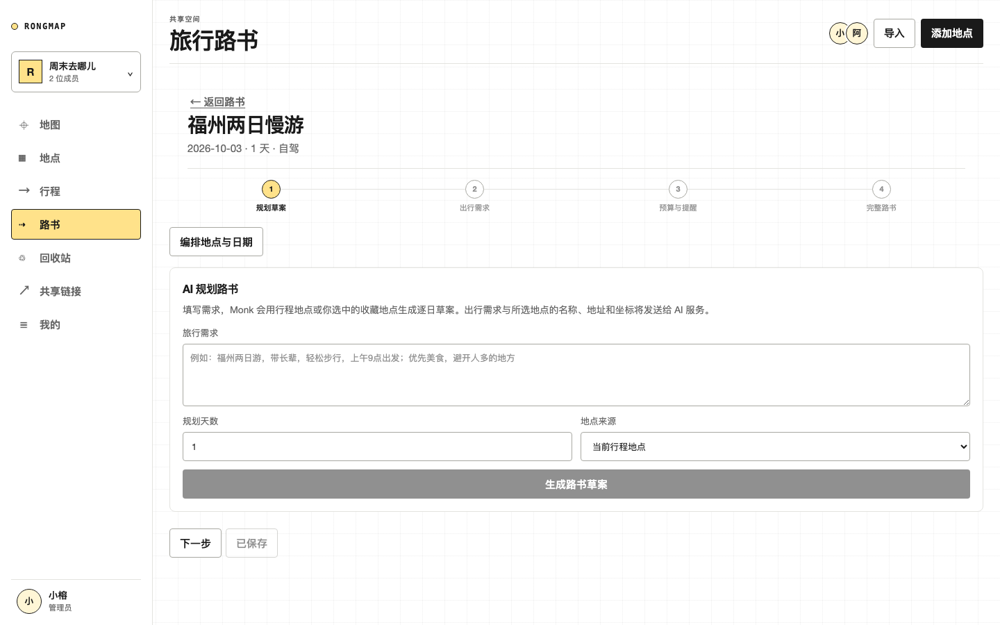
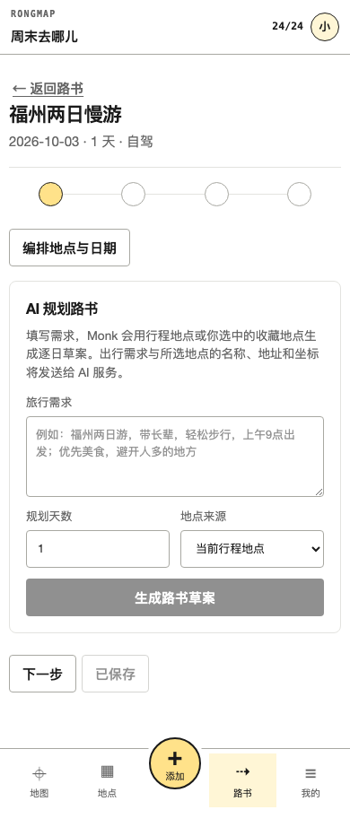

# RongMap

RongMap 是面向亲友共享的福州地点地图工作台。成员可以共同收藏、筛选、批量整理和恢复地点，管理员可以注册成员并创建可撤销的只读地图链接。近期新增**旅行路书**：把共享行程编排成逐日路书，核实当天驾车路线与天气，并导出独立网页或只读分享。

技术栈：React 19 + Vite 7 前端，Supabase（Auth / Postgres / Realtime）承载共享数据，Vercel 托管前端与 Serverless API，高德地图负责地理呈现，Monk 提供 AI 路书规划。

## 界面

桌面端路书向导（第一步：AI 规划路书）：



移动端同一步骤：



## 产品结构

- `/app/map`：三栏地图工作台，地点列表自然滚动，地图保持固定尺寸。
- `/app/locations`：全量地点、组合筛选、排序和批量操作。
- `/app/trips`：共享行程列表；可从已选地点创建逐日行程。
- `/app/trips/:id`：分天编排、跨天移动、路线优化、撤销重做和只读分享。
- `/app/roadbook`：旅行路书列表，复用共享行程；支持出行需求、逐日阅读、预算、穿着与注意事项。
- `/app/roadbook/:id`：分步向导式路书编辑（规划草案 → 出行需求 → 预算与提醒 → 完整路书）、高德当天驾车路线与天气核实、独立 HTML 导出和只读分享。
- `/app/activity`：兼容旧链接，进入“我的”中的成员活动记录。
- `/app/trash`：30 天回收站；到期条目在每次 `bootstrap` 读取时惰性清理。
- `/app/share-links`：管理员只读链接管理。
- `/app/settings`：我的；包含只读空间概览、成员与标签、活动筛选，以及回收站和共享链接入口。空间名与空间切换当前不支持编辑。
- `/share/:token`：无需登录的只读共享地图。
- `/auth/login`：只填用户名的登录页；无邮箱验证、无密码、无邀请回跳。

前端使用 React + Vite；生产认证、数据库和实时更新使用 Supabase；Vercel 继续托管前端与 Serverless API。原有 Vercel KV 读取在迁移窗口内保留兼容。

## 本地开发

```bash
npm install
npm run dev
```

仅开发 UI 时，可以使用 Playwright route mock 或将 `RONGMAP_REMOTE_FIRST=0` 写入本地环境；未配置 KV 的非生产环境会使用忽略提交的 `data/locations.local.json`。

完整 API 联调可另开终端运行：

```bash
vercel dev
```

Vite 默认将 `/api` 代理到 `http://localhost:3000`。

## 环境变量

复制 `.env.example` 为 `.env.local`，按部署环境填写：

| 变量 | 用途 |
| --- | --- |
| `VITE_SUPABASE_URL` / `VITE_SUPABASE_ANON_KEY` | 浏览器认证和实时订阅 |
| `SUPABASE_URL` / `SUPABASE_SECRET_KEY` | Serverless 管理客户端；Secret 只放服务端，未设置时回落到 `SUPABASE_SERVICE_ROLE_KEY` |
| `RONGMAP_DEFAULT_MEMBER_PASSWORD` | 服务端共享默认密码；至少 8 位，成员从不接触，只放服务端 |
| `INITIAL_ADMIN_USERNAME` / `INITIAL_ADMIN_NAME` | 首位管理员的用户名与显示名 |
| `RONGMAP_DEFAULT_SPACE_ID` / `RONGMAP_DEFAULT_SPACE_NAME` | 迁移脚本使用的默认空间 |
| `RONGMAP_LEGACY_MODE` | 仅本地旧版兼容调试设为 `1`；生产保持关闭 |
| `KV_URL` / `KV_REST_API_URL` / `KV_REST_API_TOKEN` | Vercel KV 兼容存储；仅迁移窗口内使用 |
| `RONGMAP_REMOTE_FIRST` | 设为 `0` 时不再回源预发环境，改读本地 KV 或 JSON |
| `RONGMAP_REMOTE_DEPLOYMENT_URL` | 指定回源的 Vercel 部署地址；缺省时自动取最新 Ready 部署 |
| `ENV_FILE` | 迁移与重置脚本读取的环境文件；缺省为 `.env.local` |
| `VITE_AMAP_WEB_KEY` / `VITE_AMAP_SECURITY_CODE` | 高德 JS 地图；必填，应在高德控制台限制允许域名 |
| `AMAP_WEB_SERVICE_KEY` | 地点搜索服务端接口；必填 |
| `MONK_API_BASE_URL` / `MONK_MODEL` / `MONK_API_KEY` | AI 路书生成；仅服务端，默认 `https://monk.party/v1` 与 `monk` 模型 |

`lib/roadbook-ai.js` 的 240 秒超时依赖 `vercel.json` 中 `api/v2/*.js` 的 `maxDuration: 300`；下调该值会让 AI 规划提前失败。`api/locations.js` 与 `api/search.js` 不在该 glob 内，使用平台默认时长。

源码与 `.env.example` 已不再包含任何高德密钥，缺失时地图和搜索会直接提示缺哪个变量。这三个密钥曾以明文提交进历史，必须在高德控制台轮换后再更新 Vercel；轮换前旧密钥继续可用。

## Supabase 初始化与迁移

1. 在 Supabase SQL Editor 依次执行 `20260812_shared_spaces.sql`、`20260813_harden_shared_spaces.sql`、`20260817_trips.sql`、`20260817_harden_trips.sql`、`20260901_username_only_members.sql`、`20261003063711_trip_roadbooks.sql` 和 `20261003082805_fix_trip_membership_after_username_migration.sql`。
2. 在环境变量中填写首位管理员的用户名（`INITIAL_ADMIN_USERNAME`），迁移脚本会直接创建该账号。
3. 在维护窗口冻结旧系统写入并执行 KV 备份。
4. 设置服务端环境变量后运行：

```bash
npm run backup:kv
npm run migrate:shared
```

迁移脚本会创建默认共享空间、管理员成员关系，并保留旧地点的名称、地址、分类、坐标、备注、来源和创建时间。切换生产流量前核对输出的 `spaceId` 和迁移条数。

管理员在 `/app/settings` 输入用户名和姓名即可注册成员，对方立即可用该用户名登录。用户名内部映射为 `用户名@rongmap.local` 伪邮箱（Supabase Auth 只认邮箱），成员全程不接触邮箱和密码。

需要推倒重来时，清空 Supabase 侧全部空间数据和账号，再重跑迁移：

```bash
npm run backup:kv
npm run reset:space          # 演练，只统计将删除的数据
npm run reset:space -- --yes # 确认备份后真正清空
npm run migrate:shared       # 重建管理员、空间和地点
```

旧邮箱账号无法用用户名登录，建议在清空前先记录需要保留的用户名。

> 取舍：知道用户名即可进入共享空间，无第二道凭据。需要更强身份校验时，在 `lib/member-auth.js` 的 `signInMember` 处接回密码或 TOTP 即可，前端其余链路无需改动。

## API v2

| 路径 | 能力 |
| --- | --- |
| `GET /api/v2/bootstrap` | 当前空间、成员、地点、行程摘要、标签、活动、回收站和链接 |
| `/api/v2/locations` | 创建、版本化更新和软删除地点 |
| `POST /api/v2/roadbook-ai` | 当前空间地点 + 出行需求 → AI 逐日路书草案；仅返回预览，不直接保存 |
| `POST /api/v2/roadbook` | 对当前成员空间的已保存行程，核实当天驾车路段与天气（不缓存） |
| `/api/v2/trips` | 行程摘要、完整行程、版本化保存、路线优化和删除 |
| `/api/v2/trash` | 恢复和管理员永久清理；`bootstrap` 会惰性清理超过 30 天的软删除地点 |
| `POST /api/v2/bulk` | 批量标签和移入回收站 |
| `/api/v2/import-preview` / `import-commit` | 导入预览与提交 |
| `/api/v2/tags` / `members` | 标签和成员用户名注册管理 |
| `POST /api/v2/session` | 用户名换取登录会话（免鉴权入口） |
| `/api/v2/share-links` / `public-share` | 创建、撤销和读取只读链接 |

行程路线优化使用经纬度直线距离、全起点近邻搜索和 2-opt 局部优化；未定位地点保持原相对顺序并放在当天末尾。只读链接支持完整空间和单个行程两种范围，该范围由 `share_links.scope` 与 `trip_id` 承载，两者由 `20260817_trips.sql` 添加；未应用该迁移时接口会降级为「完整空间」范围，单行程链接不会生效。

私有接口必须携带 Supabase Access Token；所有操作继续校验空间成员与角色。空间归属由服务端按登录用户的 `space_members` 关系解析，不接受客户端指定 `spaceId`。未配置 Supabase 时服务端默认关闭共享工作台，避免访客被识别成管理员。地点更新提交 `version`，版本不一致返回 `409` 和最新记录。更新地点时未传 `tagIds` 表示保持原有标签关联，传空数组才清空。

免鉴权接口仅两个：`POST /api/v2/session`（用户名换会话）与 `GET /api/v2/public-share`（只读链接读取）。`POST /api/search` 需要登录态（高德配额保护）且仅接受福州，其余 `/api/v2/*` 均需登录。

旧 `GET/POST/PUT/DELETE /api/locations` 仍带 `Deprecation: true`、`Sunset` 和指向 `/api/v2` 的 `Link` 头；Sunset 标记日期为 2026-09-30，已过期，实际是否下线以生产路由为准。`/api/search` 仍是现役地点搜索接口，未弃用。

## 目录结构

```
api/            Vercel Serverless 入口：/api/locations、/api/search、/api/v2/[route]
lib/            领域逻辑：共享存储、成员鉴权、行程路线、路书与 AI 规划、高德封装
lib/api-v2/     v2 各路由处理函数，测试文件与其同目录
src/pages/      地图工作台、行程、路书、管理页与独立页
src/components/ 工作台外壳、地点面板、地图画布、路书与弹层组件
supabase/       按时间戳命名的迁移脚本
scripts/        自检、KV 备份、共享数据迁移与空间重置
tests/          Playwright 端到端用例
docs/archive/   历史设计档案（已不作为当前规范）
artifacts/      README 截图与参考图
```

## 验证

```bash
npm run check       # 服务端语法 + Vite生产构建
npm test            # 纯函数单元测试
npm run test:e2e    # Playwright共享工作台关键流程
```

自动化视觉验收覆盖 320、390、768、1024、1440 CSS px 的横向溢出断言，移动横屏（844×390）、`prefers-reduced-motion` 与 200% 字号下的横向溢出断言；纵向内容可达性、真实高德地图、Supabase 邮件、Realtime 和 Vercel 生产路由需人工在预览部署环境完成最终验收。

## 旅行路书融合

参考 [travel-roadbook-skill](https://github.com/SpaceZephyr/travel-roadbook-skill) 的路书模块设计（源码快照 `a5678c4f1f9ed5b8c185b35e9b8d93644e0be24a`）；以现有 React、共享行程和高德 Web 服务重新实现，无需安装 Agent Skill、Python 或豆包发布工具。手机底部“活动”已替换为“路书”，原活动记录归入“我的”。

使用流程：创建路书（共享行程）→ 编排地点与日期 → 回到路书补充出行需求、花费与来源 → 保存 → 核实当天路线和天气 → 导出网页或管理员分享。出发地为需求描述，必须将出发地点加入行程首站才能核实首段路线。预算与花费均按人均计算，空白金额保留为待核实。

线上使用前依次执行 `supabase/migrations/20261003063711_trip_roadbooks.sql` 和 `supabase/migrations/20261003082805_fix_trip_membership_after_username_migration.sql`。后者修复用户名登录迁移删除成员 `status` 列后，原行程保存函数仍引用该列的问题；权限继续由空间成员关系校验。新增 JSON 字段和事务 RPC 沿用现有成员校验、版本冲突与分享撤销机制；RPC 仅允许服务端角色调用。迁移未应用时，路书保存会报错，不会退化为仅浏览器保存。

路线核实是高德逐段驾车查询，区别于原有直线距离排序优化；当天超过 5/8 小时驾驶时给出提醒。单日核实最多 25 站，每批最多 4 个并发；未定位点、失败路段明确显示未核实，不跨过未定位站拼接路线。非自驾仅查询天气，交通班次需自行核实。天气按行程日期匹配高德预报窗口，查询时间和预报发布时间显式展示。HTML 是导出快照，不包含即时天气；只读分享包含保存后的路书需求、门票预算、穿着与注意事项。

AI 规划使用 Monk OpenAI 兼容 `chat/completions` 流式接口，由服务端汇总并验证结构后返回草案。填写旅行需求和规划天数，选择当前行程或收藏地点 → 生成预览 → 应用到草稿 → 检查并保存。用户明确应用前不会改动行程；保存仍校验版本冲突。编辑区分四步：规划草案（AI 生成与行程地点编排）→ 出行需求 → 预算与提醒 → 完整路书，核实路线天气、导出网页和分享只在最后一步；有未保存修改时可随时保存，保存前导出与分享保持禁用。生成最多60个候选地点，模型只能安排这些地点；名称、地址、坐标使用服务端真源。AI 生成的票价强制为空并标注待核实；已填花费继续保留。AI 时间与建议属于草案，路线、天气由高德单独核实。

本地在忽略提交的 `.env.local` 配置 `MONK_API_KEY`；生产在 Vercel 服务端环境变量配置同名字段，禁止使用 `VITE_` 前缀。默认服务地址为 `https://monk.party/v1`，默认模型 `monk`。请求240秒超时（贴近 Vercel 函数300秒上限，实测 5 天 20 个地点约 110 秒），响应最多512KB，服务错误不回传上游响应或请求头；提示词要求紧凑输出，避免推理token耗尽max_tokens导致草案被截断。生成过程中只发送出行需求、路书需求字段，以及选中地点的名称、地址、类别和坐标，不发送成员身份和地点私人备注。

尚未接入自动搜索新地点、自动核查票价或专属 `amapuri` 行程地图生成；导航使用已有高德 URI 逐段导航，发布使用现有只读分享。

## License

[MIT](LICENSE)
